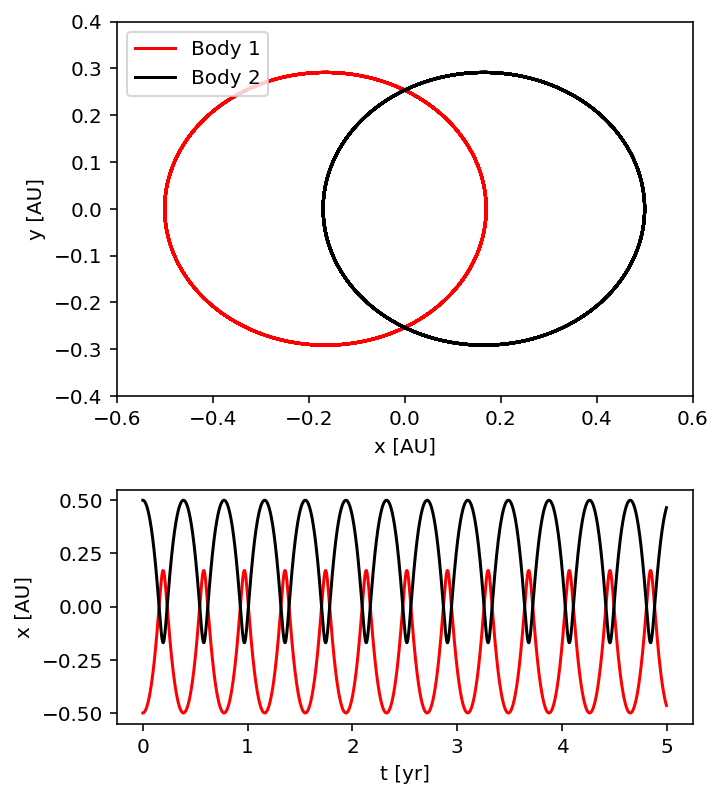
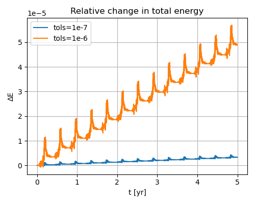
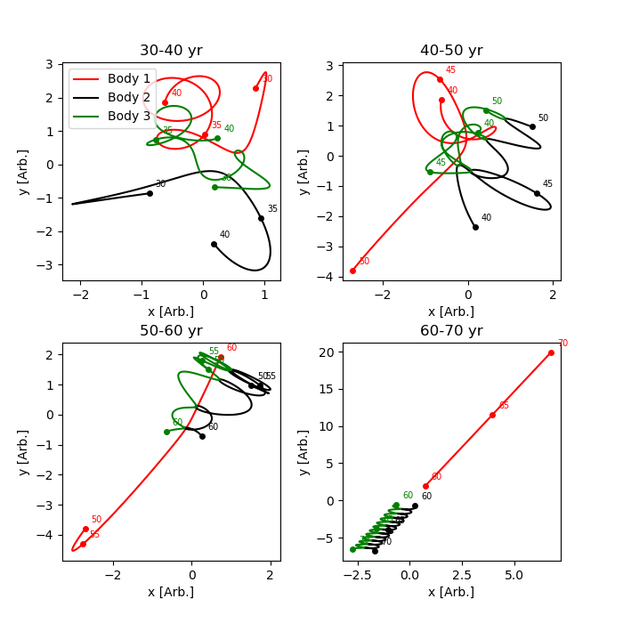
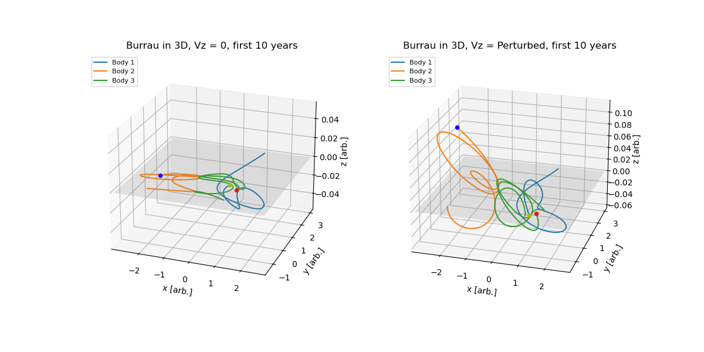
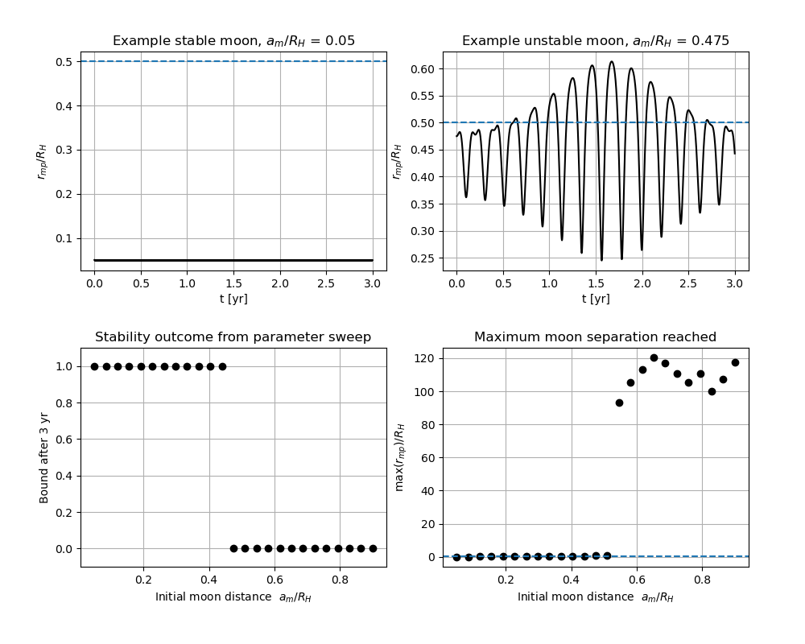
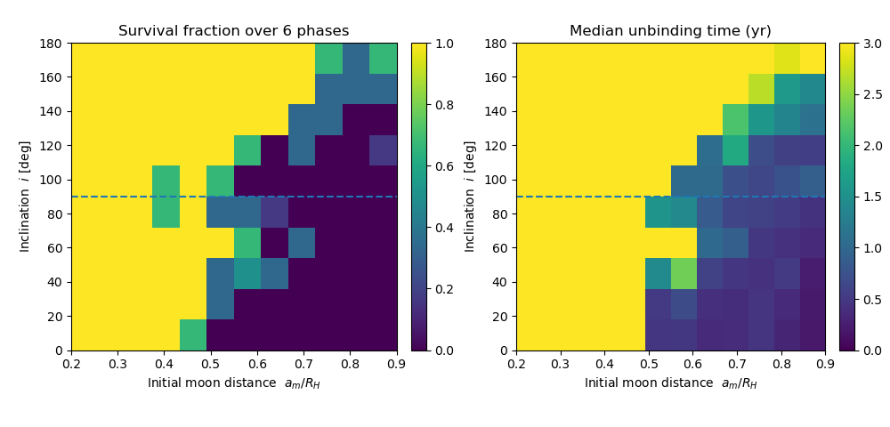
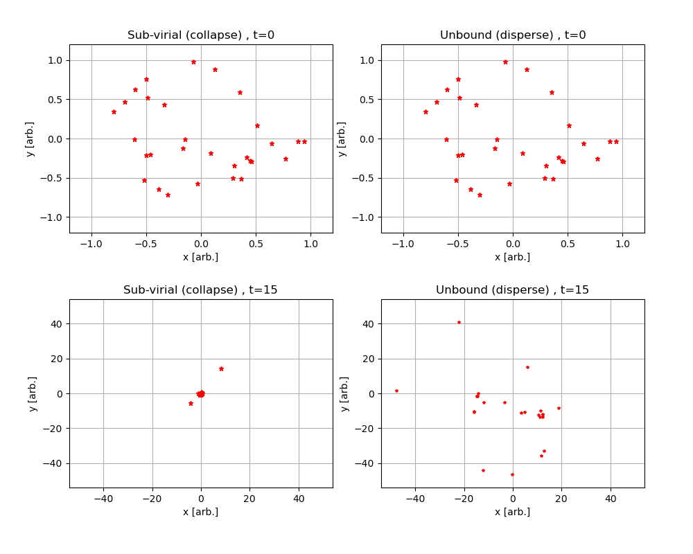
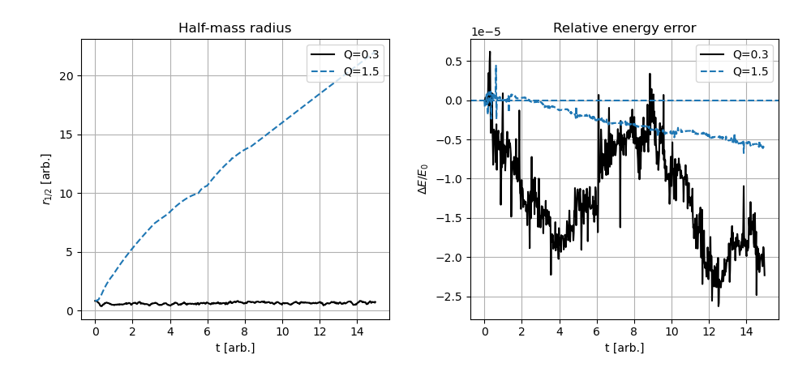

# N-Body Gravitational Dynamics & Stability Solver

An adaptive numerical integration suite in Python for modelling non-linear gravitational systems, chaotic three-body interactions, and $N$-body stellar cluster dynamics. Built using `scipy.integrate.solve_ivp` with explicit energy-conservation validation, gravitational potential softening, and multi-dimensional stability sweeps.

---

## Technical Overview

This repository models gravitational multi-body interactions across classical, chaotic, and many-body regimes:
* **Adaptive ODE Solvers:** Solves coupled second-order Newtonian equations of motion via explicit Runge-Kutta formulations.
* **Numerical Diagnostics:** Evaluates relative energy drift ($\Delta E / E_0$) as a function of solver tolerances ($10^{-6}$ vs $10^{-7}$).
* **Dimensional Scaling:** Models planar and out-of-plane ($z$-axis) perturbed chaotic three-body evolution (Burrau's problem).
* **Stability Mapping:** Monte Carlo parameter sweeps of Hill-sphere capture limits across orbital inclinations ($0^\circ \le i \le 180^\circ$) and orbital phases.
* **Singularity Regularisation:** Employs potential softening length ($\epsilon = 0.15$) to prevent numerical divergence during close encounters in $N=30$ particle systems.

---

## Modules & Simulated Systems

### 1. Analytic Validation & Energy Conservation (`01_two_body_validation.py`)
* Simulates equal-mass binary orbits orbiting their common centre of mass.
* Verifies closed circular trajectories and phase-inverted periodic motion over a five-year integration baseline.
* Quantifies integration accuracy: tightening tolerances from $10^{-6}$ to $10^{-7}$ reduces accumulated relative energy error by over an order of magnitude ($\vert{}\Delta E\vert{} \le 3 \times 10^{-6}$).

<p align="center">
  
  
</p>

### 2. Chaotic Three-Body Dynamics (`02_burrau_three_body.py` & `03_burrau_3d_perturbation.py`)
* Implements Burrau's Pythagorean three-body problem ($m_1=3, m_2=4, m_3=5$ at rest on a 3-4-5 triangle).
* Tracks chaotic exchange interactions across decades, resolving the eventual formation of a stable binary pair and the high-velocity ejection of the lightest body ($m_1$).
* Extends integration to full 3D space, showing orbital evolution following out-of-plane velocity perturbations ($v_z = \pm 0.03$).

<p align="center">
  
  
</p>

### 3. Hill Sphere Stability Sweeps (`04_hill_stability_sweep.py` & `05_phase_averaged_stability.py`)
* Evaluates moon stability in a Sun-Earth-Moon three-body system across initial semi-major separations $a_m / R_H \in [0.05, 0.9]$.
* Maps survival fractions and median unbinding times across orbital inclination ($0^\circ$ prograde to $180^\circ$ retrograde) over 6 initial orbital phases.
* Confirms enhanced dynamical stability for retrograde orbits, which remain bound at significantly larger fractions of the Hill radius.

<p align="center">
  
  
</p>

### 4. Stellar Cluster Collapse & Dispersion (`06_stellar_cluster_evolution.py`)
* Simulates $N=30$ equal-mass particles initialised with zero total momentum and zero centre-of-mass drift.
* Incorporates a gravitational softening parameter ($\epsilon = 0.15$) to prevent force singularities during close stellar encounters:

$$\mathbf{a}_i = -G \sum_{j \neq i} \frac{m_j (\mathbf{r}_i - \mathbf{r}_j)}{(|\mathbf{r}_i - \mathbf{r}_j|^2 + \epsilon^2)^{3/2}}$$

* Compares sub-virial core collapse ($Q = 0.3$) against unbound energetic dispersion ($Q = 1.5$), tracking the median half-mass radius ($r_{1/2}$) and relative energy error under $10^{-6}$ tolerances.

<p align="center">
  
  
</p>

---

## Installation & Usage

### Dependencies
Ensure Python 3.10+ is installed. Install required scientific packages:

```bash
pip install -r requirements.txt
